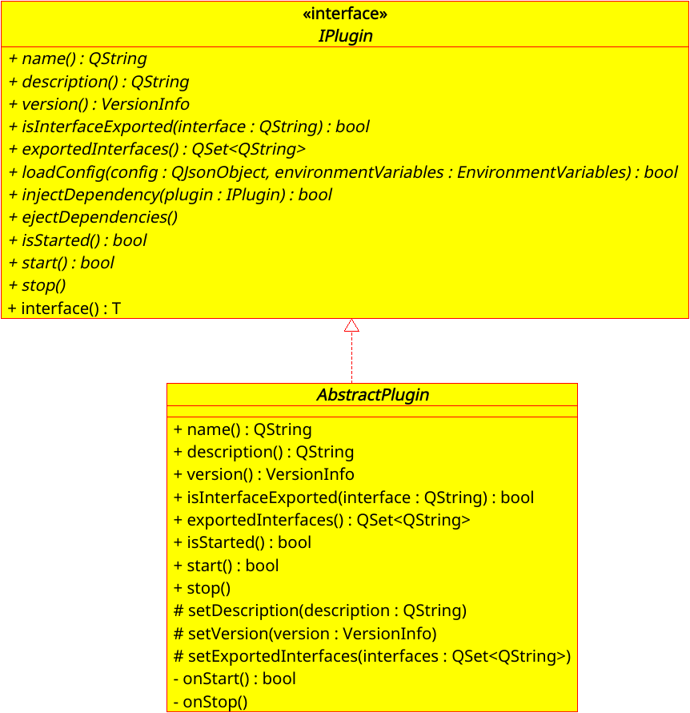
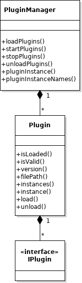
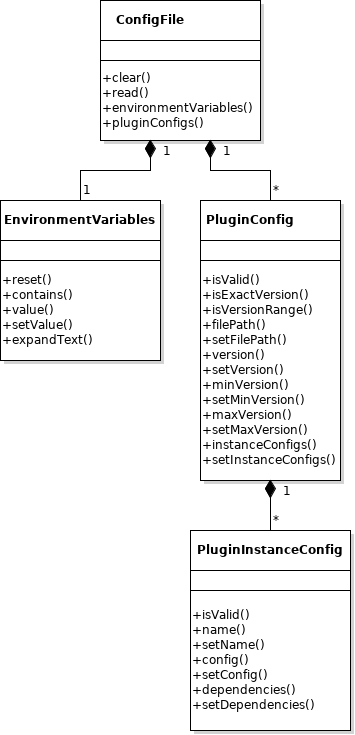
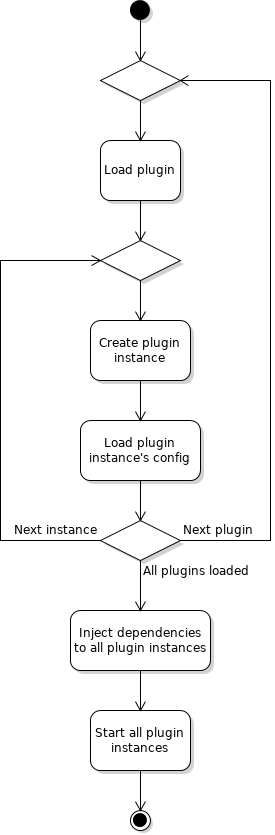
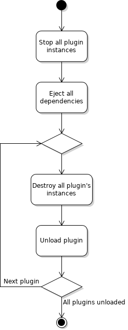

# Design

The plugin framework has two main uses:

* Creating plugins
* Plugin management


## Plugins

Each plugin provides the following metadata:

* Instance Name
* Description
* Version
* Exported Interfaces

Each plugin also provides some management possibilities:

* Configuration of the plugin
* Injection and ejection of its dependencies
* Stating and stopping of the plugin

The main purpose of the plugin is to export an interface to a specific functionality. Each exposed interface can be accessed by using the `interface()` method.




### Plugin Implementation

All plugins must inherit from the `IPlugin` interface.

Most plugins should be able to use `AbstractPlugin` base class. This class provides implemention of the "boilerplate" part of a plugin. If it is used then only the following needs to be implemented:

* Loading the plugin's configuration (optional feature)
* Management of plugin's dependencies (optional feature)
* Handling of plugin startup and shutdown procedures (for some plugins the default implementation might be good enough)
* Exported interfaces (one or more)

For more advanced uses `IPlugin` interface should be used directly.


### Dynamically Linked Library

A dynamically linked library must be created for each plugin. This library must provide functions for:

* Reading the plugin version
* Creating an instance of the plugin

```cpp
const char *readPluginVersion();
CppPluginFramework::IPlugin *createPluginInstance(const QString &instanceName);
```


## Plugin Management

Applications that want to use plugins need to use `PluginManager` class. Its purpose is to:

* Load the plugins
* Create and configure plugin instances
* Provide access to the plugin instances
* Inject dependencies into plugin instances
* Start the plugins
* Stop the plugins
* Eject dependencies from plugin instances
* Unload the plugins




### Configuration

The configuration must be represented in a JSON object (stored either in a file or a string) and it needs to provide:

* Environment variables (optional)
* Plugin configuration




#### Environment Variables

Initially all the system environment variables are loaded. The variables can be access by name, new environment variables can be created, and existing ones can be updated.

The environment variables can also be reset which removes all of the current environment variables and all the system environment variables are loaded again.

A convenience method `expandText()` is provided which can be used to replace all references of environment variables in the specified input text.


#### Plugin Configuration

Plugin configuration is represented in a two level hiearchy: plugins and plugin instances

Each plugin needs to provide the following information:

* Plugin file path
* Version requirements
* List of plugin instances (at least one)

Each plugin instance needs to provide the following information:

* Plugin instance name
* Configuration
* List of plugin dependencies


### Plugin Startup Workflow

First the configuration must be loaded (from a JSON file or string) with the help of `ConfigFile` class, then the configured plugins can be loaded and initialized (plugin instances are created and configured and dependencies are injected to all plugin instances). The application then just needs to start the plugins.

The plugins get started in the same order as defined in the configuration (from first plugin instance in the first plugin to the last plugin instance in the last plugin).




### Plugin Shutdown Workflow

When the application no longer needs the plugins it should first stop the plugins and then unload them.

