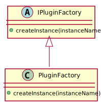
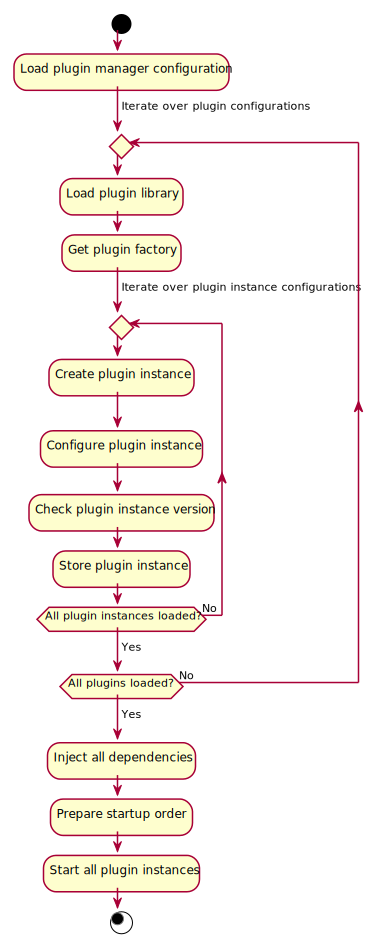

# Design

The plugin framework has two main uses:

* Creating plugins
* Plugin management

## Plugins

Each plugin shall provide the following metadata:

* Instance Name
* Version
* Description
* Exported Interfaces

Each plugin shall also provide some management features:

* Configuration of the plugin
* Injection and ejection of its dependencies
* Stating and stopping of the plugin

The main purpose of the plugin is to export an interface to a specific functionality. Each exposed interface can be accessed by using the `interface()` method.

### Plugin Implementation

All plugins shall inherit from the `IPlugin` interface.

For most plugins it should be sufficient to use the `AbstractPlugin` base class. This class shall provide implementation of the *boilerplate* part of a plugin. The plugins that shall use it shall only need to implement the following:

* Loading the plugin's configuration (optional feature)
* Management of plugin's dependencies (optional feature)
* Handling of plugin startup and shutdown procedures (for some plugins the default implementation should be good enough)
* Exported interfaces (one or more)

For more advanced uses it shall be necessary to use the `IPlugin` interface directly.

### Dynamically Linked Library

A dynamically linked library shall be created for each plugin. This library shall provide a plugin factory with which individual plugin instances can be created.

## Plugin Management

Applications that want to use plugins need to use `PluginManager` class. Its purpose is to:

* Load the plugins
* Create and configure plugin instances
* Provide access to the plugin instances
* Inject dependencies into plugin instances
* Start the plugins
* Stop the plugins
* Eject dependencies from plugin instances
* Unload the plugins

### Configuration

The configuration must be represented in *CppConfigFramework* format.

Plugin management configuration shall be represented in a three level hierarchy: plugin manager, plugins, and plugin instances.

The plugin manager shall provide the following information:

* Plugin configurations
* Plugin startup priorities (optional)

Each plugin shall provide the following information:

* Plugin file path
* Version requirements (exact version or version range)
* List of plugin instances (at least one)

Each plugin instance needs to provide the following information:

* Plugin instance name
* Configuration (optional)
* List of plugin dependencies (optional)

### Plugin Startup Workflow

The application shall first load the configuration (from a *CppConfigFramework* file or equivalent *JSON Object*) and then the configured plugins shall be loaded with the plugin manager. Finally the application shall start the plugins.

The plugins shall be started in the same order as defined in the configuration. First all the plugins from the *plugin startup priorities* shall be started (in the defined order) and then all the others (in no particular order).

### Plugin Shutdown Workflow

When the application no longer needs the plugins it shall first stop the plugins and then unload them.

